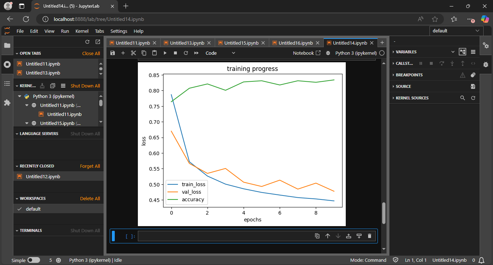

# Softmax Regression on Fashion-MNIST (PyTorch)

Implementation of multinomial logistic regression (softmax regression) using PyTorch, trained and evaluated on the Fashion-MNIST dataset.

This project demonstrates end-to-end model development including data loading, training, validation, evaluation, and performance visualization.

---

## 📊 Overview

- **Task**: Multi-class classification (10 clothing categories)
- **Dataset**: Fashion-MNIST (60,000 train / 10,000 test)
- **Framework**: PyTorch (`nn.Module`, `DataLoader`)
- **Training**: Train/validation split with loss + accuracy tracking
- **Epochs**: 10
- **Evaluation**: Final test on unseen data

---

## 🧮 Model Architecture

| Component | Description |
|-----------|-------------|
| **Type** | Single-layer softmax regression |
| **Input** | 784 features (28×28 flattened images) |
| **Output** | 10 classes |
| **Parameters** | 7,850 (784×10 weights + 10 biases) |
| **Loss** | `CrossEntropyLoss` |
| **Optimizer** | SGD (learning rate = 0.01) |

---

## 📈 Results

**Test Accuracy**: **[Insert your accuracy]%** (after 10 epochs)


*Training/validation loss and accuracy over 10 epochs*

**Key observations:**
- ✅ Model converges within 10 epochs
- ✅ Training and validation loss decrease steadily
- ✅ Small gap between train/validation → good generalization
- ✅ Accuracy improves consistently each epoch

---

## 🏗️ Project Structure

```
softmax_regression_on_FashionMNIST_data/
├── loss_curve.png                    # Training visualization (10 epochs)
├── data/
│   └── FashionMNIST.py                # Data loading & preprocessing
├── module/
│   ├── classifier.py                   # Softmax model definition
│   ├── data_module.py                   # DataLoader utilities
│   ├── module.py                         # Core helper functions
│   └── trainer.py                         # Training loop
├── src/
│   └── softmax_regression.py            # Main model logic
├── main.py                                # Entry point
└── README.md                               # You are here
```

---

## 🚀 How to Run

### 1. Install dependencies
```bash
pip install torch torchvision matplotlib numpy
```

### 2. Run training
```bash
python main.py
```

The script will:
- Download Fashion-MNIST automatically (via `data/FashionMNIST.py`)
- Train the softmax model for 10 epochs
- Evaluate on test data
- Save the loss/accuracy plot as `loss_curve.png`

---

## 📦 Module Breakdown

| File | Purpose |
|------|---------|
| `data/FashionMNIST.py` | Downloads and preprocesses Fashion-MNIST |
| `module/classifier.py` | `SoftmaxRegression` class (`nn.Module`) |
| `module/data_module.py` | Creates train/validation/test DataLoaders |
| `module/module.py` | Core utilities and helper functions |
| `module/trainer.py` | Training loop with loss/accuracy tracking |
| `src/softmax_regression.py` | Main orchestration logic |
| `main.py` | Entry point - runs the full pipeline |

---

## ✅ What This Project Demonstrates

- **Multi-class classification** with softmax
- **Proper dataset splits** (train/validation/test)
- **Modular PyTorch** implementation
- **Model evaluation** methodology
- **Clean code organization** (separate concerns)
- **From theory to working code**

---

## 🔍 Possible Improvements

- Add L2 regularization (weight decay)
- Increase epochs for better convergence
- Implement early stopping
- Compare optimizers (SGD vs Adam)
- Add confusion matrix visualization
- Extend to Multi-Layer Perceptron

---

## 👨‍💻 Author

**Joseph Tobi Mayokun**
